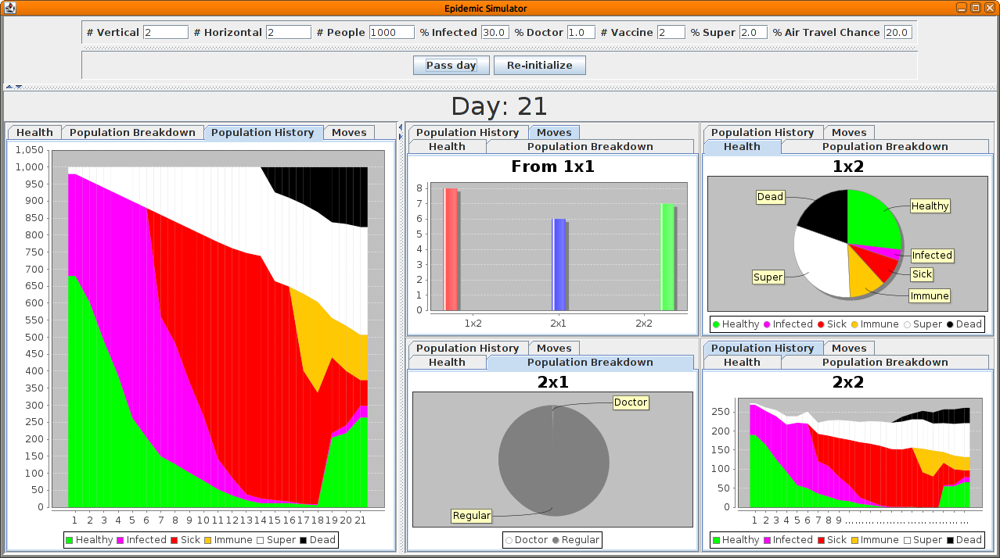

# CS534 Epidemic Simulator

This is an implementation of the CS534 project defined
[here](https://aktemur.github.io/cs534/project_epidemic.html)

## To Compile and Run

`./gradlew runApp`

## Documents

### Post Mortem

[Post Mortem report](./POSTMORTEM.md)

This report is a post mortem of the project. It discusses the design decisions
and challenges.

### UMLs

[UMLs](./UMLS.md)

This report contains some UMLs of the design.
